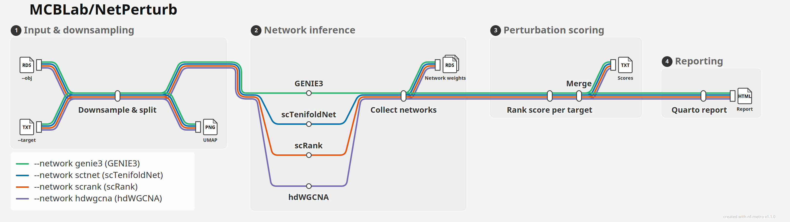

# NetPerturb 🧬

**MCBLab/NetPerturb** is a scalable Nextflow pipeline designed to infer Gene Regulatory Networks (GRNs) and calculate single-cell expression ranking perturbation scores using the scRank algorithm. 

Previous GRN tools are often difficult to scale for large Single-Cell RNA-seq (scRNA-seq) datasets. In this context, `NetPerturb` was built to enable high-throughput perturbation scoring in a user-friendly, parallelized, and computationally effective way. The pipeline uses Singularity containers, making installation trivial and results highly reproducible across high-performance computing (HPC) environments.

## Pipeline Overview

<picture>
  <source media="(prefers-color-scheme: dark)" srcset="docs/images/netperturb_metro_dark.png">
  
</picture>

Each coloured line is one `--network` method. The four are mutually exclusive, so a
run rides exactly one line from `--obj`/`--target` through to the HTML report: they
share downsampling, scoring and reporting, and diverge only at network inference.

<details>
<summary>Regenerating this diagram</summary>

The map is defined in [`docs/netperturb_metro.mmd`](docs/netperturb_metro.mmd) and
rendered with [nf-metro](https://github.com/seqeralabs/nf-metro) (`pip install nf-metro`):

```bash
# FS bumps every text size and the label metrics that drive spacing, so the
# layout re-flows rather than just overprinting bigger glyphs.
FS=1.25

# Theme-aware SVG and an interactive pan/zoom page
nf-metro render docs/netperturb_metro.mmd -o docs/images/netperturb_metro.svg --font-scale $FS --embed-font --responsive
nf-metro render docs/netperturb_metro.mmd -o docs/images/netperturb_metro.html --format html --font-scale $FS --animate

# The baked light/dark PNGs used above (needs `pip install cairosvg`;
# --no-chrome-css bakes the colours, since rasterisers cannot resolve var())
for m in light dark; do
  nf-metro render docs/netperturb_metro.mmd -o /tmp/nm_$m.svg --mode $m --font-scale $FS --no-chrome-css --embed-font
  cairosvg /tmp/nm_$m.svg -s 2 -o docs/images/netperturb_metro_$m.png
done

# Print/poster assets: vector SVG and PDF, plus a 4x raster fallback
cp /tmp/nm_light.svg docs/images/netperturb_metro_poster.svg
cairosvg /tmp/nm_light.svg -f pdf -o docs/images/netperturb_metro_poster.pdf
cairosvg /tmp/nm_light.svg -s 4  -o docs/images/netperturb_metro_poster@4x.png
```

For print, use `docs/images/netperturb_metro_poster.pdf` or `.svg` — both are true
vector, so they stay sharp at any poster size. Raise `FS` above if the text still
reads small at your final dimensions; past roughly `1.4` the station and output
captions begin to collide.

Every station carries a `%%metro process:` mapping, so the map can also track a live
run. Serve it and point Nextflow's weblog at it:

```bash
nf-metro serve docs/netperturb_metro.mmd --port 8080
nextflow run main.nf -profile test,singularity -with-weblog http://localhost:8080/events
```

After changing the pipeline's processes, re-check the mappings still line up:

```bash
nextflow run main.nf -profile test -preview -with-dag dag.mmd
nf-metro check-mapping docs/netperturb_metro.mmd --dag dag.mmd
```

</details>

## Pipeline Summary

The workflow executes the following core modules:

### 1. Object Parsing and Downsampling (`DOWNSAMPLE`)
This is the initial step of the process. It ingests a fully processed Seurat object (`.rds`) and identifies the user-defined metadata column containing the cell identities (e.g., cell types or clones). To ensure statistical robustness and equitable GRN inference, it randomly downsamples the cells from each identity to a specified maximum number (`--n_cells`), balancing the computational load. It also writes a UMAP of the retained cells coloured by `--column` to `downsample/umap_<column>.png`, so the identities entering the analysis, and their relative sizes after downsampling, can be checked at a glance. An embedding already present on the object is reused; one is computed only if the object carries none. Drawing this figure is guarded, so a plotting failure leaves a placeholder image rather than stopping the run.

### 2. Network Inference (`GENIE3`, `SCTENIFOLDNET`, `SCRANK`, `HDWGCNA`)
This is the heavy-lifting computational core. For each downsampled cellular identity, the pipeline infers a gene regulatory network using the method selected with `--network`: `genie3` runs [GENIE3](https://bioconductor.org/packages/release/bioc/html/GENIE3.html), `sctnet` runs SCTENIFOLDNET, `scrank` uses the scRank network strategy, and `hdwgcna` runs [hdWGCNA](https://smorabit.github.io/hdWGCNA/) on metacells. Each method returns regulatory interaction weights between genes for each cell state.

The hdWGCNA module aggregates cells into metacells, builds an unsigned co-expression network and then adapts its topological overlap matrix (TOM) to what scRank expects from a network. Four things happen to the raw TOM:

1. **Sign recovery.** A TOM is always positive, so activation and repression are indistinguishable in it. Each edge is multiplied by the sign of the correlation between the same two genes across metacells, keeping the TOM magnitude but restoring its direction of effect. The network is built as `unsigned` for this reason: a `signed` adjacency already pushes anti-correlated pairs towards zero, so repressive edges would be cut before the sign could be recovered.
2. **Padding to a shared gene universe.** Genes dropped by hdWGCNA quality control return as zero rows and columns, so every cell identity is described over the same gene set. scRank refuses to align networks whose features differ.
3. **Sparsification.** A TOM is fully dense, which would make every gene a neighbour of every other one and flatten the degree and entropy terms scRank scores on. Edges whose absolute weight falls below the `--cut_ratio` quantile are cut.
4. **Rescaling.** Weights are divided by the largest absolute weight so that they span `[-1, 1]`, the range scRank's manifold alignment and its agonist mode both assume.

Cell identities that are too small to aggregate into metacells, or for which hdWGCNA otherwise fails, are skipped with a message in the log rather than failing the run. They are absent from the final ranking.

### 3. Perturbation Scoring (`RANK_SCORE`)
Using the list of target genes (`--target`) provided by the user, this module extracts the specific regulatory weight of the targets from the GENIE3 output. It calculates the perturbation score, which reflects how much the network relies on the specific target gene within that specific cell state.

### 4. Consolidate Results (`MERGE`)
This step collects the perturbation scores from all parallel `RANK_SCORE` tasks and merges them into a single, clean text file, ready for downstream visualization.

### 5. Report (`REPORT`)
Renders `perbscore_all_targets.txt` into a self-contained Quarto HTML report (`report/netperturb_report.html`): a searchable, filterable table of every cell type x target score, a heatmap of scores across all cell types and targets that were run, and the DOWNSAMPLE UMAP as a closing cell-identity overview. Every figure is embedded in the HTML, so the report is a single portable file.

## Quick Start
1. Install [`Nextflow`](https://www.nextflow.io/docs/latest/getstarted.html) (`>=22.10.1`).
2. Install [`Singularity`](https://www.sylabs.io/guides/3.0/user-guide/) (highly recommended for full pipeline reproducibility).
3. Start running your analysis!

```bash
# Quick example
nextflow run netperturb/main.nf \
  -profile test,singularity

# Example with all parameters
nextflow run netperturb/main.nf \
  --obj /path/to/your/seurat_object.rds \
  --column clone_annotation \
  --species human \
  --n_cells 3000 \
  --binding antagonist \
  --n_cores 32 \
  --target /path/to/targets.txt \
  --network genie3 \
  --outdir results \
  -profile singularity

``` 

### Inputs and References
NetPerturb requires the following main parameters:

`--obj`: Path to a fully processed Seurat object (`.rds` or compatible serialized object) containing normalized RNA assays and metadata annotations.

`--column`: Metadata column in the Seurat object that defines the cellular identities to compare, such as cell type, cluster, treatment group, clone, or phenotype.

`--species`: Species used by scRank when building and scoring regulatory networks. Accepted values depend on the underlying scRank annotation support, commonly `human` or `mouse`.

`--target`: Path to a text file containing the target genes to score. Each line should contain one target entry. If multiple genes should be evaluated together as one perturbation set, separate them with semicolons, for example `Stfa1;Mpo`. Max number is `two` targets at same time.

```sh
# Example
Brd4
Cstdc5
Stfa1;Mpo
```

`--network`: Network inference method to use. Supported values are `genie3`, `sctnet`, `scrank`, and `hdwgcna`.

`--cut_ratio`: Quantile of absolute edge weight below which edges are cut, used by `--network hdwgcna`. Defaults to `0.95`, the same threshold scRank applies to its own networks, which keeps the strongest 5% of edges. Lower it to retain a denser network. Because a TOM has a different weight distribution than the regression coefficients scRank normally works with, this value is worth tuning on your data.

`--hdwgcna_min_cells`: Minimum number of cells an identity must have for `--network hdwgcna` to attempt metacell aggregation. Defaults to `150`. Identities below it are skipped.

`--n_cells`: Maximum number of cells to keep per cellular identity during downsampling. If an identity has fewer cells than this value, the pipeline uses all available cells for that identity.

`--binding`: Perturbation mode passed to the scoring step, for example `antagonist` or `agonist`.

`--n_cores`: Number of CPU cores requested for parallelizable network inference and scoring steps.

`--outdir`: Directory where the final results and pipeline reports will be written. Defaults to `results`.

### Outputs
If successfully run, the workflow will generate its primary output in the specified --outdir:

rank_scores/perbscore_all_targets.txt: A consolidated table containing the cell identity (cell_type), the evaluated gene (target), and its final regulatory importance (perb_score).

```sh
# Example
cell_type	target	binding	perb_score
sensitive	Stfa1;Mpo	antagonist	1.38837233985176e-06
resistant	Stfa1;Mpo	antagonist	3.86382149842044e-06
sensitive	Brd4	antagonist	1.5395821350262e-06
resistant	Brd4	antagonist	1.61320913209275e-06
sensitive	Cstdc5	antagonist	1.30868421341405e-06
resistant	Cstdc5	antagonist	2.91128461301128e-06
```

report/netperturb_report.html: A self-contained Quarto report built from `perbscore_all_targets.txt`, with a queryable table and a cell type x target heatmap of perturbation scores.

Other intermediate files (such as split matrices and raw GENIE3 weights) are temporarily stored in the work directory and can be retained or discarded based on standard Nextflow cache management.

### Development
[`docs/IMPLEMENTATION.md`](docs/IMPLEMENTATION.md) records how the pipeline was built, grouped into waves of work rather than individual commits.

#### Tests
The pipeline is covered by [nf-test](https://www.nf-test.com/). The default suite runs every process through its `stub` block, so it pulls no containers and executes no R, and finishes in about a minute:

```bash
nf-test test
```

It checks the wiring rather than the science: that `--network` selects exactly one inference process, that each line of the target file becomes its own `RANK_SCORE` task, that `MERGE` gathers them under a single header, that an unsupported `--network` aborts before any task is launched, and that every network module names its output so `rank_score.R` can still recover the cell identity from the file name.

The end to end run is opt-in, since it downloads the test object and pulls containers. It is excluded from the default suite and has its own config:

```bash
nf-test test -c nf-test.integration.config --tag integration --profile test,singularity
```

Note for machines running the uutils reimplementation of coreutils, the default on recent Ubuntu: Nextflow's task wrapper times tasks with `date +%s%3N`, and uutils ignores the `%3N` width modifier. The wrapper then aborts every task with `Unexpected: unbound variable` before the script runs. This affects any Nextflow pipeline on such a machine, not just this one. Installing GNU coreutils resolves it.

### Credits
NetPerturb is developed and maintained by the Marques-Coelho Bioinformatics Lab(MCBLab).

### Citations
If you use this pipeline in your research, please cite:

...
